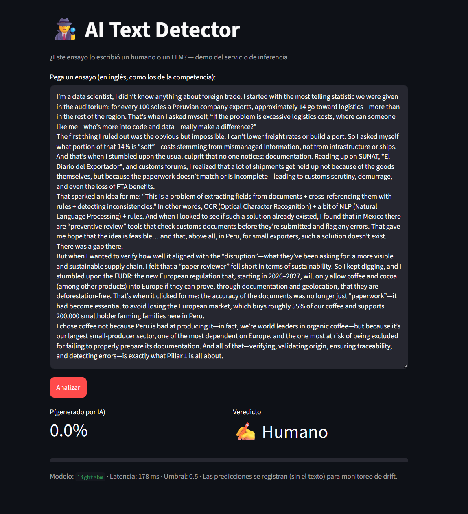
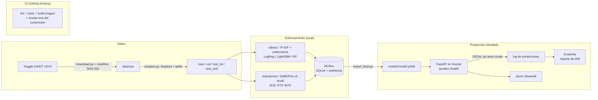

# AI Text Detector — ¿humano o LLM?

[](https://github.com/o-quispemonzon/ai-text-detector/actions/workflows/ci.yml)

Clasificador de ensayos **escritos por humanos vs. generados por LLMs**, basado en la
competencia de Kaggle [LLM - Detect AI Generated Text](https://www.kaggle.com/competitions/llm-detect-ai-generated-text)
y el dataset comunitario DAIGT-v3 (65k ensayos, 28 fuentes, 11 familias de generadores).

El proyecto compara dos enfoques de modelado de punta a punta y envuelve al ganador en un
stack de MLOps que corre **100% en local** (sin nube): MLflow, Docker, GitHub Actions,
FastAPI, Evidently y Streamlit. Entrenado en una laptop (i9-14900HX, RTX 4070 8GB, WSL2).

## ¿Por qué este proyecto?

Arranqué con una pregunta que me venía dando vueltas: ¿cuánto aporta *de verdad* un
transformer frente a un TF-IDF bien hecho en esta tarea? Todo el mundo asume que el modelo
grande gana, pero en la competencia real de Kaggle los char n-grams dieron pelea seria, y
yo quería medir esa brecha con mis propias manos y un split que no se haga trampa. Y de
paso demostrarme algo más: que un modelo no es un proyecto. El pipeline reproducible, los
tests, el CI y el monitoreo son la otra mitad del trabajo, y esa mitad es la que casi nunca
se ve en un notebook.

## Resultados

Evaluación en dos niveles — un test aleatorio estratificado (**IID**) y un test con las
familias de generadores **claude, palm y cohere excluidas por completo del entrenamiento**
(**OOD**): mide si el detector generaliza a LLMs que nunca vio, que es el problema real.

| Modelo | Features | AUC val | AUC test IID | AUC test OOD | Entrenamiento |
|---|---|---|---|---|---|
| Logistic Regression | TF-IDF word+char + estilometría | 0.9994 | 0.9993 | 0.9992 | ~4 min (CPU) |
| LightGBM | TF-IDF word+char + estilometría | 0.9995 | **0.9996** | 0.9993 | ~21 min (CPU) |
| Random Forest (ablación) | solo estilometría (16 features) | 0.9804 | 0.9795 | 0.9700 | <1 min (CPU) |
| DeBERTa-v3-small (fine-tuned) | texto crudo, 512 tokens | **0.9997** | **0.9996** | **0.9998** | ~67 min (GPU) |

### Lo que aprendí de estos números (lectura honesta)

1. **Los char n-grams son brutalmente efectivos aquí.** Un modelo lineal de los 2000s
   empata en la práctica con un transformer fine-tuneado (diferencia < 0.001 AUC). No me
   lo esperaba tan parejo, pero coincide con la competencia real, donde los mejores
   enfoques usaban n-grams de caracteres.
2. **El transformer gana justo donde importa: OOD** (0.9998 vs 0.9993). Su representación
   semántica transfiere mejor a generadores que nunca vio. Pero esa cuarta cifra decimal
   cuesta 286MB de modelo, una GPU para entrenar y una latencia en CPU dos órdenes de
   magnitud mayor.
3. **La ablación de solo-estilometría me mostró dónde está la grieta:** cae de 0.980 IID a
   0.970 OOD. El "estilo" (puntuación, variedad léxica, longitud de oraciones) cambia
   entre familias de LLMs; lo que sostiene la transferencia es el vocabulario compartido.
4. **Y el escepticismo obligatorio:** mi test OOD no es tan duro como suena, porque los
   generadores held-out escriben sobre los *mismos 15 prompts* del corpus. Un OOD por
   dominio (otros temas, otros registros) sería la prueba de fuego, y es la extensión
   natural de este trabajo. Un AUC de 0.999 aquí no significa 0.999 en producción contra
   los LLMs de 2026 — y prefiero decirlo yo antes de que me lo pregunten.

**Decisión de producción:** elegí servir **LightGBM** (mejor AUC OOD del enfoque clásico).
Me quedo con milisegundos de latencia en CPU y una imagen Docker liviana antes que con la
cuarta cifra decimal del transformer. La justificación completa, con trade-offs, está en
[docs/decisions.md](docs/decisions.md).

## Demo



La demo Streamlit consumiendo la API en vivo: un ensayo escrito por mí (traducido al
inglés) clasificado como humano con P(IA) = 0.0%, en 178 ms de latencia sobre CPU con el
modelo LightGBM servido. Cada predicción queda registrada (sin el texto) para el
monitoreo de drift.

## Arquitectura



## Reproducción local

Requisitos: WSL2/Linux, [uv](https://docs.astral.sh/uv/), cuenta de Kaggle, Docker
(opcional), GPU NVIDIA (solo para el transformer).

```bash
make setup            # dependencias (uv, incluye torch CUDA en Linux)
# token de Kaggle en ~/.kaggle/kaggle.json (kaggle.com -> Settings -> API)
make data             # descarga DAIGT + manifest con hashes
make prepare          # limpieza + 4 splits reproducibles (seed=42)
make test             # 27 tests
make train-classic    # 3 modelos clásicos -> MLflow
make train-transformer  # DeBERTa-v3-small (GPU, ~1h)
make mlflow           # UI de experimentos en :5000

make export-model     # mejor modelo (AUC OOD) -> models/
make serve            # API en :8000 (docs interactivas en /docs)
make streamlit        # demo visual (cliente de la API)
make simulate-traffic && make drift-report   # monitoreo con Evidently
make docker-build && make docker-run         # serving containerizado
```

## Estructura

```
configs/            YAML de datos y modelos (una sola fuente de verdad)
data/               gitignored; manifest.json versiona hashes y procedencia
docker/             Dockerfile.serve (CPU, multi-stage, non-root)
docs/decisions.md   por qué cada herramienta (MLflow, manifest vs DVC, CI sin GPU...)
monitoring/         drift con Evidently + simulador de tráfico
notebooks/          EDA con el diseño de splits fundamentado
src/data            descarga idempotente + limpieza + splits
src/features        TF-IDF (word/char) + 16 features estilométricas (sklearn transformers)
src/models          entrenamiento clásico y transformer + export desde MLflow
src/serving         FastAPI + schemas + logging de predicciones
tests/              27 tests (datos, features, métricas, API)
.github/workflows   CI: lint, tests, build Docker + smoke test del contenedor
```

## Decisiones de MLOps (resumen)

MLflow con backend SQLite en lugar de W&B (100% local, sin cuenta); manifest con SHA-256
en lugar de DVC (los datasets son estáticos; time-travel no aporta); el CI valida código y
pipeline con un modelo dummy pero nunca entrena (runners CPU-only); la API loggea
predicciones sin texto crudo (privacidad) en JSONL (sin locks de SQLite en NTFS/9p); la
demo Streamlit es cliente de la API, no carga el modelo (el monitoreo vive en el servicio).
Detalle y trade-offs: [docs/decisions.md](docs/decisions.md).

## Créditos y datos

Datasets DAIGT de la comunidad de Kaggle (Darek Kłeczek y colaboradores). Este repo no
redistribuye datos: `make data` los descarga de la fuente y verifica integridad.

Proyecto de portafolio de Alejandro Quispe (Ciencia de Datos, UTEC — Lima, Perú).
Me lo planteé como un sprint de 7 días; terminó saliendo en 4.
